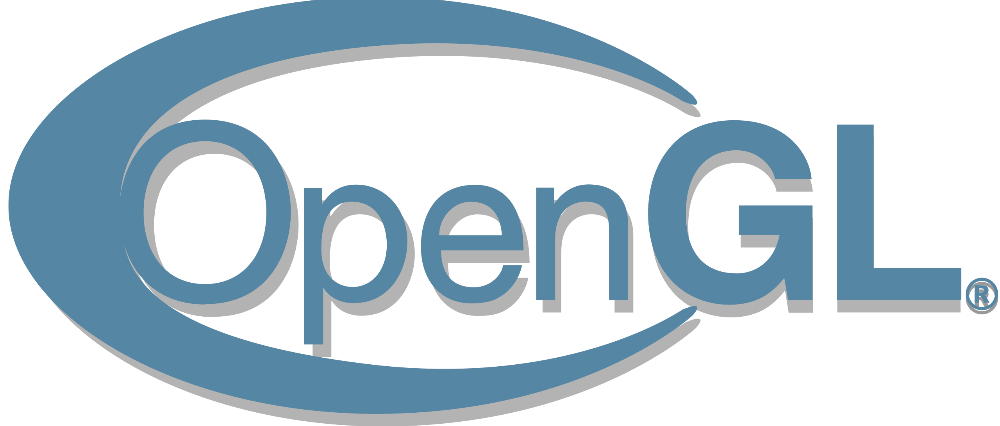

<h1 align="center">
  <br>
  <a href="https://jotrocken.blog/"></a>
  <br>
  Cataglyphis Engine
  <br>
  <a href="https://jotrocken.blog/"></a>
  <br>
</h1>

<h4 align="center">A graphics engine built on top of OpenGL <a href="https://jotrocken.blog/" target="_blank"></a>.</h4>

<!-- <p align="center">
  <a href="https://paypal.me/JonasHeinle?locale.x=de_DE">
    
  </a>
</p> -->

<p align="center">
  <a href="#key-features">Key Features</a> •
  <a href="#how-to-use">How To Use</a> •
  <a href="#download">Download</a> •
  <a href="#related">Related</a> •
  <a href="#license">License</a> •
  <a href="#literature">Literature</a>
</p>

<!-- TABLE OF CONTENTS -->
<details open="open">
  <summary>Table of Contents</summary>
  <ol>
    <li>
      <a href="#about-the-project">About The Project</a>
      <ul>
        <li><a href="#built-with">Built With</a></li>
      </ul>
      <ul>
        <li><a href="#key-features">Key Features</a></li>
      </ul>
    </li>
    <li>
      <a href="#getting-started">Getting Started</a>
      <ul>
        <li><a href="#prerequisites">Prerequisites</a></li>
        <li><a href="#installation">Installation</a></li>
      </ul>
    </li>
    <li><a href="#usage">Usage</a></li>
    <li><a href="#roadmap">Roadmap</a></li>
    <li><a href="#contributing">Contributing</a></li>
    <li><a href="#license">License</a></li>
    <li><a href="#contact">Contact</a></li>
    <li><a href="#acknowledgements">Acknowledgements</a></li>
    <li><a href="#literature">Literature</a></li>
  </ol>
</details>

<!-- ABOUT THE PROJECT -->
## About The Project

[![Kataglyphis Engine][product-screenshot]](https://jotrocken.blog/)

The thought behind this project is to implement modern algortihms and 
techniques that modern graphic engines rely on. 
Furthermore it should serve as a framework to enable further investigations
in own research topics.
Feel free to contribute and adding stuff :)
Reminder: This project is based on my interest in implementing algortihms by
my own and make own research. Hence you might encounter some bugs. Feel free 
to report.

### Key Features


|          Feature                |   Implement Status | ◾ Other Configs |
| --------------------------------| :----------------: | :-------------: |
| Directional Lights              |         ✔️         |        ❌      |
| Point Lights                    |         ✔️         |        ❌      |
| Spot Lights                     |         ✔️         |        ❌      |
| Directional Shadow Mapping      |         ✔️         |        ❌      |
| Omni-Directional Shadow Mapping |         ✔️         |        ❌      |
| Cascaded Shadow Mapping         |         ✔️         |        ❌      |
| Cloud system                    |         ✔️         |        ❌      |
| Sky box                         |         ✔️         |        ❌      |

### Built With

With the provided CMake file you are able to built the project on Linux (Ubuntu is tested)
and Windows. I do not provide support for MacOS. Be aware of the dependencies: 

* [OpenGL 4.6](https://www.opengl.org//)
* [GLM](https://github.com/g-truc/glm)
* [GLFW](https://www.glfw.org/)
* [TINYOBJLOADER](https://github.com/tinyobjloader/tinyobjloader)
* [IMGUI](https://github.com/ocornut/imgui)
* [GLEW](https://github.com/Perlmint/glew-cmake)
* [STB](https://github.com/nothings/stb)
* [DOXYGEN](https://www.doxygen.nl/index.html)
* [GTEST](https://github.com/google/googletest)

<!-- GETTING STARTED -->
## Getting Started

You might only clone the repo and get to go immediately :)

### Prerequisites

You will need OpenGL. If you want to build documantaries you will need [DOXYGEN] (https://www.doxygen.nl/index.html).


### Installation

1. Clone the repo

   ```sh
   git clone --recurse-submodules git@github.com:Kataglyphis/GraphicEngine.git
   ```
   Important for init the submodules

2. Then build your solution with [CMAKE] (https://cmake.org/)


<!-- USAGE EXAMPLES -->
## Usage


<!-- ROADMAP -->
## Roadmap
Upcoming :)
<!-- See the [open issues](https://github.com/othneildrew/Best-README-Template/issues) for a list of proposed features (and known issues). -->


<!-- CONTRIBUTING -->
## Contributing

Contributions are what make the open source community such an amazing place to be learn, inspire, and create. Any contributions you make are **greatly appreciated**.

1. Fork the Project
2. Create your Feature Branch (`git checkout -b feature/AmazingFeature`)
3. Commit your Changes (`git commit -m 'Add some AmazingFeature'`)
4. Push to the Branch (`git push origin feature/AmazingFeature`)
5. Open a Pull Request


<!-- LICENSE -->
## License

Distributed under the GPL-3.0 License. See `LICENSE` for more information.


<!-- CONTACT -->
## Contact

Jonas Heinle - [@your_twitter](https://twitter.com/Cataglyphis_) - jonasheinle@googlemail.com

Project Link: [https://github.com/Kataglyphis/GraphicsEngine](https://github.com/Kataglyphis/OpenGLEngine)


<!-- ACKNOWLEDGEMENTS -->
## Acknowledgements

I want to thank my partner Kansei who worked with me on a project. This project arised from this university project.


## Literature 

Some very helpful literature, tutorials, etc. 

OpenGL 
* [learnopengl.com](https://learnopengl.com/)
* [ogldev.org](https://ogldev.org/)

Clouds
* [PBR](https://www.pbr-book.org/)

<!-- MARKDOWN LINKS & IMAGES -->
<!-- https://www.markdownguide.org/basic-syntax/#reference-style-links -->
[contributors-shield]: https://img.shields.io/github/contributors/othneildrew/Best-README-Template.svg?style=for-the-badge
[contributors-url]: https://github.com/othneildrew/Best-README-Template/graphs/contributors
[forks-shield]: https://img.shields.io/github/forks/othneildrew/Best-README-Template.svg?style=for-the-badge
[forks-url]: https://github.com/othneildrew/Best-README-Template/network/members
[stars-shield]: https://img.shields.io/github/stars/othneildrew/Best-README-Template.svg?style=for-the-badge
[stars-url]: https://github.com/othneildrew/Best-README-Template/stargazers
[issues-shield]: https://img.shields.io/github/issues/othneildrew/Best-README-Template.svg?style=for-the-badge
[issues-url]: https://github.com/othneildrew/Best-README-Template/issues
[license-shield]: https://img.shields.io/github/license/othneildrew/Best-README-Template.svg?style=for-the-badge
[license-url]: https://github.com/othneildrew/Best-README-Template/blob/master/LICENSE.txt
[linkedin-shield]: https://img.shields.io/badge/-LinkedIn-black.svg?style=for-the-badge&logo=linkedin&colorB=555
[linkedin-url]: https://www.linkedin.com/in/jonas-heinle-0b2a301a0/
[product-screenshot]: images/Screenshot1.png


