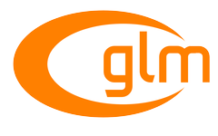
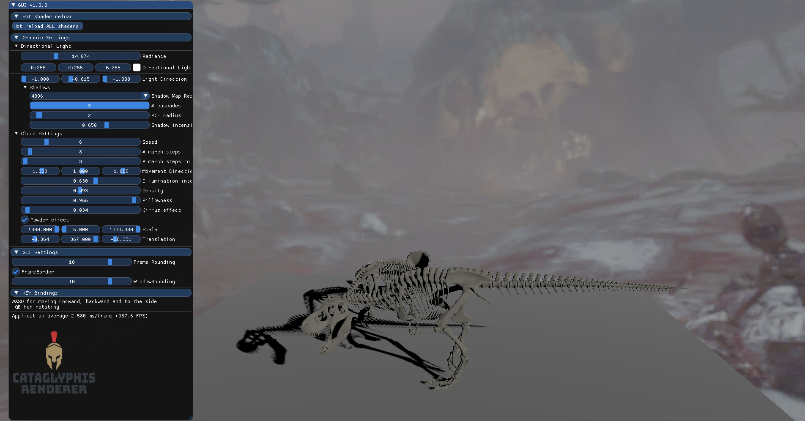
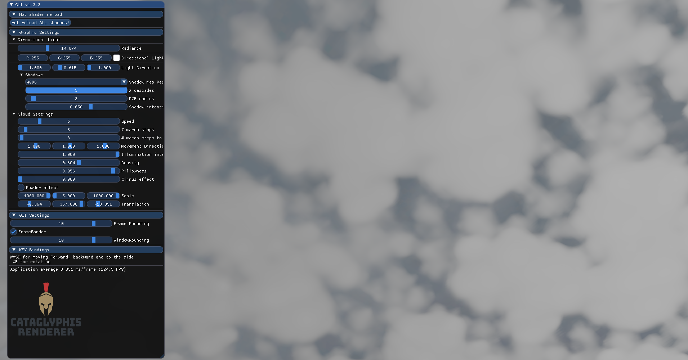
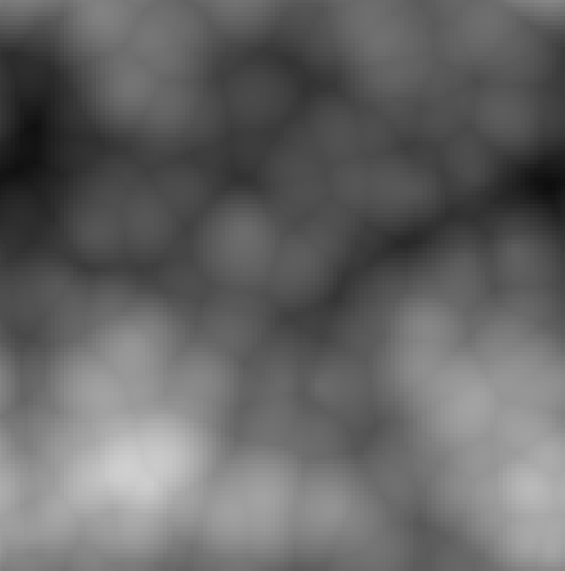
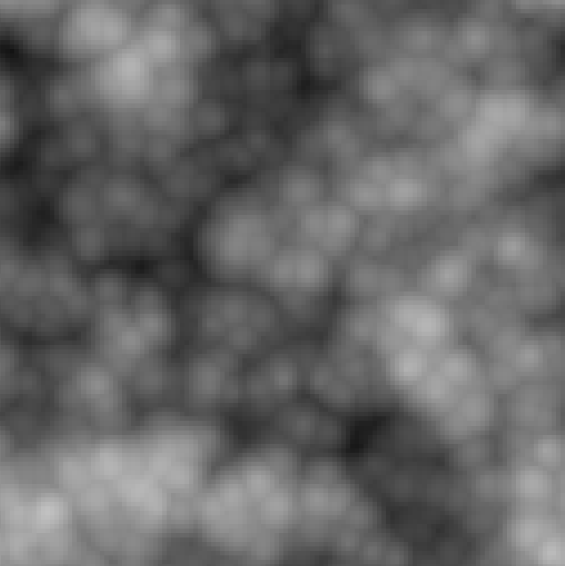

> **__NOTE:__** I moved development of this repo to my graphics engine that also supports Vulkan (see [here](https://github.com/Kataglyphis/GraphicsEngineVulkan)).

<h1 align="center">
  <br>
  <a href="https://jotrockenmitlocken.de"></a>
  <br>
  Cataglyphis Engine
  <br>
  <br>
  <a href="https://jotrockenmitlocken.de"></a>
  <a href="https://jotrockenmitlocken.de"></a>
  <br>
</h1>

<h4 align="center">A graphics engine built on top of OpenGL <a href="https://jotrockenmitlocken.de" target="_blank"></a>.</h4>

[](https://github.com/Kataglyphis/GraphicEngine/actions/workflows/Windows.yml)
[](https://github.com/Kataglyphis/GraphicEngine/actions/workflows/Linux.yml)
[](https://codecov.io/gh/Kataglyphis/GraphicEngine)
[]()
[](https://www.paypal.com/donate/?hosted_button_id=BX9AVVES2P9LN)
[](https://twitter.com/Cataglyphis_)
[](https://www.youtube.com/channel/UC3LZiH4sZzzaVBCUV8knYeg)
<p align="center">
  <a href="#key-features">Key Features</a> •
  <a href="#how-to-use">How To Use</a> •
  <a href="#download">Download</a> •
  <a href="#related">Related</a> •
  <a href="#license">License</a> •
  <a href="#literature">Literature</a>
</p>

<!-- TABLE OF CONTENTS -->
<details open="open">
  <summary>Table of Contents</summary>
  <ol>
    <li>
      <a href="#about-the-project">About The Project</a>
      <ul>
        <li><a href="#built-with">Built With</a></li>
      </ul>
      <ul>
        <li><a href="#key-features">Key Features</a></li>
      </ul>
    </li>
    <li>
      <a href="#getting-started">Getting Started</a>
      <ul>
        <li><a href="#prerequisites">Prerequisites</a></li>
        <li><a href="#installation">Installation</a></li>
      </ul>
    </li>
    <li><a href="#testing">Tests</a></li>
    <li><a href="#roadmap">Roadmap</a></li>
    <li><a href="#contributing">Contributing</a></li>
    <li><a href="#license">License</a></li>
    <li><a href="#contact">Contact</a></li>
    <li><a href="#acknowledgements">Acknowledgements</a></li>
    <li><a href="#literature">Literature</a></li>
  </ol>
</details>

<!-- ABOUT THE PROJECT -->
## About The Project

<h1 align="center">
  <br>
  <a href="https://jotrockenmitlocken.de"></a>
  <a href="https://jotrockenmitlocken.de"></a>
  <br>
  <a href="https://jotrockenmitlocken.de"></a>
  <a href="https://jotrockenmitlocken.de"></a>
</h1>
<!-- [![Kataglyphis Engine][product-screenshot]](https://jotrockenmitlocken.de) -->

This project provides me a solid modern OpenGL renderer starting point
for implementing modern established rendering techniques and getting quickly
started in own research topics. <br/>
Frequently tested under <br /> 
* [latest windows and ubuntu version]
* [GCC/CLANG/MSVC] 
### Key Features

<!-- ❌ -->
|          Feature                              |   Implement Status | 
| --------------------------------              | :----------------: | 
| Directional Lights                            |         ✔️         |
| Point Lights                                  |         ✔️         |
| Spot Lights                                   |         ✔️         |
| Directional Shadow Mapping                    |         ✔️         |
| Omni-Directional Shadow Mapping               |         ✔️         |
| Cascaded Shadow Mapping                       |         ✔️         |
| Cloud system                                  |         ✔️         |
| 3D-worley noise generation                    |         ✔️         |
| .obj Model loading                            |         ✔️         |
| PBR support (UE4,disney,phong, etc.)          |         ✔️         |
| Support for `#include` directives in shaders. |         ✔️         |
| Sky box                                       |         ✔️         |
| Supporting compute shader                     |         ✔️         |
| On the fly 3D worley/perlin noise creation    |         ✔️         |

### Built With

With the provided CMake file you are able to built the project on Linux (Ubuntu is tested)
and Windows. I do not provide support for MacOS. Be aware of the dependencies: 

* [OpenGL 4.6](https://www.opengl.org//)
* [GLAD](https://glad.dav1d.de/)
* [glm](https://github.com/g-truc/glm)
* [glfw](https://www.glfw.org/)
* [tinyobjloader](https://github.com/tinyobjloader/tinyobjloader)
* [imgui](https://github.com/ocornut/imgui)
* [glad](https://github.com/Dav1dde/glad)
* [stb](https://github.com/nothings/stb)
* [doxygen](https://www.doxygen.nl/index.html)
* [gtest](https://github.com/google/googletest)
* [cmake](https://cmake.org/)
* [gsl](https://github.com/Microsoft/GSL)
* [NSIS](https://nsis.sourceforge.io/Main_Page)

### Useful tools (you might also considering :) )

* [cppcheck](https://cppcheck.sourceforge.io/)
* [renderdoc](https://renderdoc.org/)
* [nsightgraphics](https://developer.nvidia.com/nsight-graphics)
* [valgrind](https://valgrind.org/)
* [clangtidy](https://github.com/llvm/llvm-project)
* [visualstudio](https://visualstudio.microsoft.com/de/)
* [ClangPowerTools](https://www.clangpowertools.com/)
* [Codecov](https://app.codecov.io/gh)

<!-- GETTING STARTED -->
## Getting Started

You might only clone the repo and get to go immediately :)

### Prerequisites

Dependencies to libraries are stated above.<br />
C++20 or higher required.<br />
C17 or higher required.<br />
CMake 3.20 or higher required.<br />
> **_NOTE:_** This project relies on the newest OpenGL version and their features.


### Installation

1. Clone the repo

   ```sh
   $ git clone --recurse-submodules git@github.com:Kataglyphis/GraphicEngine.git
   ```
   Important for init the submodules.
   > **_NOTE:_**  With powershell in Windows git has currently a problem with cloning recursively. You might consider using
the git bash.

2. Then build your solution with [CMAKE] (https://cmake.org/) <br />
  Here the recommended way over command line after cloning the repo:<br />
  (for clarity: Assumption you are in the dir you have cloned the repo into)
  ```sh
  $ mkdir build ; cd build
  # enlisting all available presets
  $ cmake --list-presets=all ../
  $ cmake --preset <configurePreset-name> ../
  $ cmake --build --preset <buildPreset-name> .
  # necessary for making Resources available to test framework
  $ cmake -E copy_directory ../Resources/ Test/Resources/
  ```

  Alternatively you can use the build scripts I use for my standard configuration: <br/>
  * [`buildEngine.sh`] 
  * [`buildEngine.bat`]
  ```sh
  $ {WORKING_DIR}/GraphicsEngine/buildEngine[.sh/.bat]
  ```

<!-- TESTS -->
## Tests
* [Watch test results here](Documents/googletest/test_detail.xml)
<h3>Code coverage results</h3>
<h1 align="center">
  <a href="https://jotrockenmitlocken.de"></a>
  <a href="https://jotrockenmitlocken.de"></a>
</h1>

<!-- ROADMAP -->
## Roadmap
Watch the refman generated by doxygen. <br/>
* [Watch it here](Documents/refman.pdf)

<!-- CONTRIBUTING -->
## Contributing

Contributions are what make the open source community such an amazing place to be learn, inspire, and create. Any contributions you make are **greatly appreciated**.

1. Fork the Project
2. Create your Feature Branch (`git checkout -b feature/AmazingFeature`)
3. Commit your Changes (`git commit -m 'Add some AmazingFeature'`)
4. Push to the Branch (`git push origin feature/AmazingFeature`)
5. Open a Pull Request


<!-- LICENSE -->
## License

Distributed under the GPL-3.0 License. See `LICENSE` for more information.


<!-- CONTACT -->
## Contact

Jonas Heinle - [@Cataglyphis_](https://twitter.com/Cataglyphis_) - renderdude@jotrockenmitlocken.de

Project Link: [https://github.com/Kataglyphis/GraphicsEngine](https://github.com/Kataglyphis/OpenGLEngine)


<!-- ACKNOWLEDGEMENTS -->
## Acknowledgements

I want to thank my partner Kansei who worked with me on a project. This project arised from this university project.
* [Loading Screen Image](https://www.golem.de/news/raumfahrt-spacex-macht-sicherheitstest-bei-hoechster-belastung-2001-146124.html)

Thanks for free 3D Models: 
* [Morgan McGuire, Computer Graphics Archive, July 2017 (https://casual-effects.com/data)](http://casual-effects.com/data/)

## Literature 

Some very helpful literature, tutorials, etc. 

* [View Frustum Culling](http://www.lighthouse3d.com/tutorials/view-frustum-culling/geometric-approach-extracting-the-planes/)

CMake/C++
* [Cpp best practices](https://github.com/cpp-best-practices/cppbestpractices)

OpenGL 
* [learnopengl.com](https://learnopengl.com/)
* [ogldev.org](https://ogldev.org/)
* [Cascaded Shadow Maps](https://ahbejarano.gitbook.io/lwjglgamedev/chapter26)
* [Compute Shader in OpenGL](https://antongerdelan.net/opengl/compute.html)

Clouds
* [pbr-book](https://www.pbr-book.org/)
* [Inigo Quilez](https://iquilezles.org)
* [Shadertoy Horizon Zero Dawn](https://www.shadertoy.com/view/WddSDr)
* [Sebastian Lague](https://m.youtube.com/watch?v=4QOcCGI6xOU&t=97s)
* [Horizon Zero Dawn](http://advances.realtimerendering.com/s2015/The%20Real-time%20Volumetric%20Cloudscapes%20of%20Horizon%20-%20Zero%20Dawn%20-%20ARTR.pdf)
* [Clouds and noise](https://thebookofshaders.com/12/)
* [Shadertoy Clouds using 3D Perlin noise](https://www.shadertoy.com/view/XlKyRw)

Noise
* [Worley noise online demo](https://github.com/Erkaman/glsl-worley)

Physically Based Shading
* [Advanced Global Illumination by Dutre, Bala, Bekaert](https://www.oreilly.com/library/view/advanced-global-illumination/9781439864951/)
* [The Bible: PBR book](https://pbr-book.org/3ed-2018/Reflection_Models/Microfacet_Models)
* [Real shading in Unreal engine 4](https://blog.selfshadow.com/publications/s2013-shading-course/karis/s2013_pbs_epic_notes_v2.pdf)
* [Physically Based Shading at Disney](https://blog.selfshadow.com/publications/s2012-shading-course/burley/s2012_pbs_disney_brdf_notes_v3.pdf)
* [RealTimeRendering](https://www.realtimerendering.com/)
* [Understanding the Masking-Shadowing Function in Microfacet-Based BRDFs](https://hal.inria.fr/hal-01024289/)
* [Sampling the GGX Distribution of Visible Normals](https://pdfs.semanticscholar.org/63bc/928467d760605cdbf77a25bb7c3ad957e40e.pdf)

<!-- MARKDOWN LINKS & IMAGES -->
<!-- https://www.markdownguide.org/basic-syntax/#reference-style-links -->
[contributors-shield]: https://img.shields.io/github/contributors/othneildrew/Best-README-Template.svg?style=for-the-badge
[contributors-url]: https://github.com/othneildrew/Best-README-Template/graphs/contributors
[forks-shield]: https://img.shields.io/github/forks/othneildrew/Best-README-Template.svg?style=for-the-badge
[forks-url]: https://github.com/othneildrew/Best-README-Template/network/members
[stars-shield]: https://img.shields.io/github/stars/othneildrew/Best-README-Template.svg?style=for-the-badge
[stars-url]: https://github.com/othneildrew/Best-README-Template/stargazers
[issues-shield]: https://img.shields.io/github/issues/othneildrew/Best-README-Template.svg?style=for-the-badge
[issues-url]: https://github.com/othneildrew/Best-README-Template/issues
[license-shield]: https://img.shields.io/github/license/othneildrew/Best-README-Template.svg?style=for-the-badge
[license-url]: https://github.com/othneildrew/Best-README-Template/blob/master/LICENSE.txt
[linkedin-shield]: https://img.shields.io/badge/-LinkedIn-black.svg?style=for-the-badge&logo=linkedin&colorB=555
[linkedin-url]: https://www.linkedin.com/in/jonas-heinle-0b2a301a0/
[product-screenshot]: images/Screenshot.png


